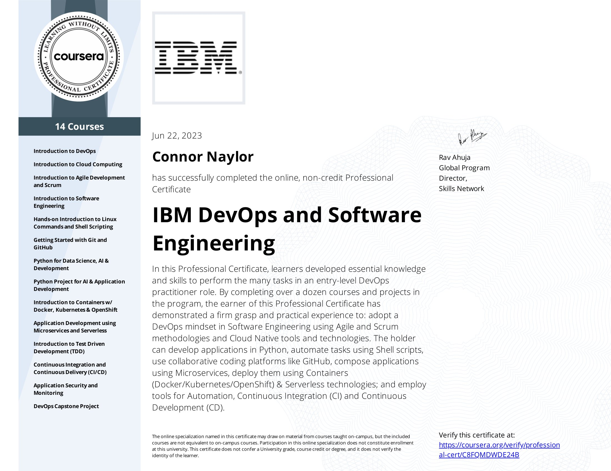
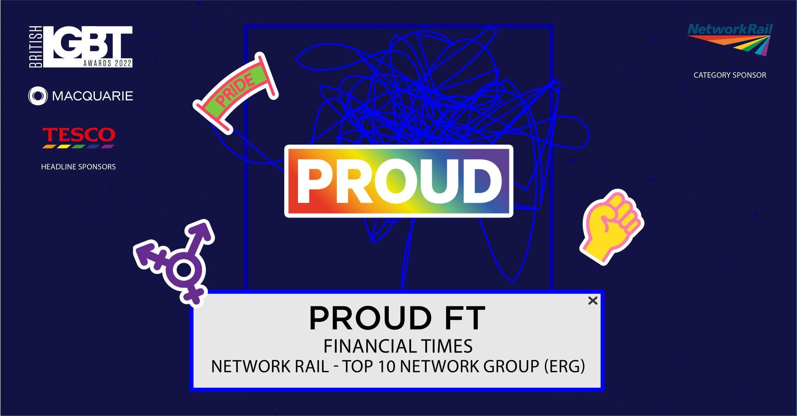
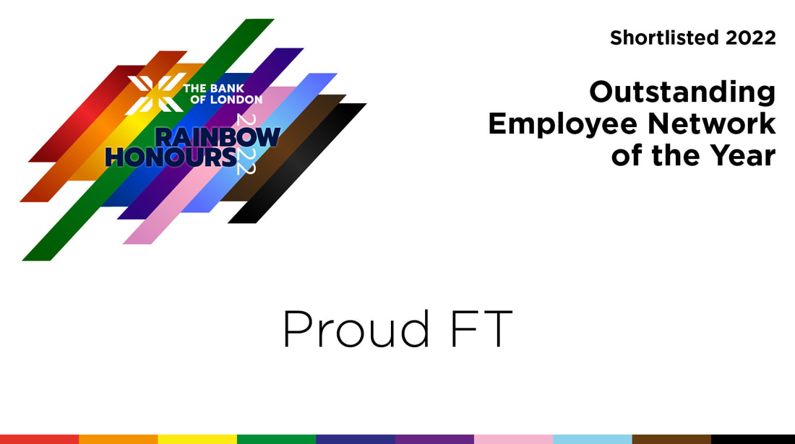
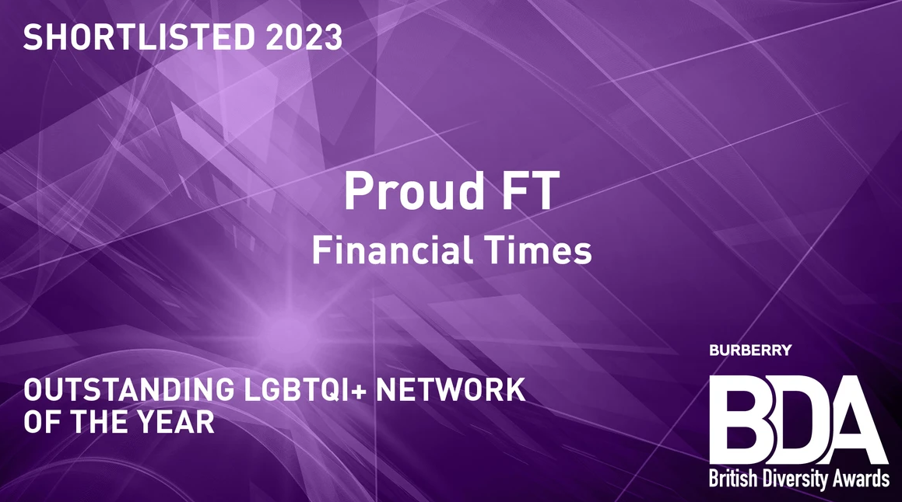

# Cassius Naylor #

#

[About me](#about_me) | [Technologies](#tech-stack) | [Projects](#projects) | [Skills](#skills) | [Education](#education) | [Experience](#experience) | [Interests](#interests)

## <a name="about_me">Me, myself and I</a>

Experienced media professional making a career-change into the technology space, having recently graduated from the Makers Academy software development bootcamp. My  background is in corporate communications, diversity & inclusion, commercial account management and investigative journalism.

At my core, I’m a geek for systems. I can't abide inefficiency and have an innate drive to systematise, optimise and structure processes in my work to achieve high-quality outcomes; to be less powerpoint about it, I like to make things run better. This inclination has allowed me to deliver complex, multi-stakeholder projects - from tech RFPs to corporate policy to commercial media content - at the highest level of the UK news sector. I’m driven towards the public good, and think about my work with an eye towards its impact in advancing society, making life operationally easier and safer, more inclusive and less harmful to the planet.

I am most comfortable in JavaScript - primarily across the M.E.R.N. stack - and am also versed in TypeScript, Ruby, CSS, HTML, and testing frameworks like Cypress and Jest. To extend those skills I recently completed a 14-course IBM certification in DevOps and software engineering, and am undertaking the AWS Cloud Solutions Architect professional cerficiation at associate level. My ideal role would involve working full-stack across the whole development lifecycle, and I’m especially keen to develop my skills in data analysis, information security and applied AI.

## <a name="tech-stack"> Technical experience </a> 

### Languages

### Databases

### Frameworks, Platforms and Libraries

## <a name="projects"> My headline projects so far </a>

| Project (Repo)   | Description | Technologies |
|---        |---          |---              |
| [eatGPT](https://github.com/addauk/recipe-generator) | Combined recipe generator/culinary social media service for time-poor cooks and show-off chefs, built on the MERN stack as bootcamp final project | ReactJS, NodeJS, ExpressJS, MongoDB Atlas, TailwindCSS, BCrypt |
| [burnbook](https://github.com/SimpleLuke/acebook-fire) | Social network service built from a basic legacy codebase on the MERN stack | ReactJS, NodeJS, MongoDB, ExpressJS, TailwindCSS |
| [MakersBnB](https://github.com/SimpleLuke/makersbnb-ruby) | Database-backed, account-based system for owners to list their properties for short-term let, and for users to lease those properties. | Ruby (ActiveRecord), Sinatra, PostgreSQL, RSpec, Rackup |
| [JS-PY Translator](https://github.com/Perspicacity11/JS-PY-Translator) | Django app with a minimal Bootstrap interface, which receives unformatted JS code and translates it into formatted Python3. Powered by the OpenAI API | Python, Django, HTML, Bootstrap CSS, OpenAI API |
| [Personal website](https://cassiusnaylor.com) | Single-page portfolio website built with React and deployed with Vercel (not currently optimised for mobile). | ReactJS, HTML, CSS, EmailJS, Vercel |

For more, please see my [GitHub repo list](https://github.com/Perspicacity11?tab=repositories).

## <a name="skills">My primary non-technical skills</a>

#### Team & project management ####

- My past roles have required the ability to think strategically, to prioritise effectively, and to exercise judgement in running operations for small, medium and large teams
- Holistic understanding of the commercial side of tech, as both vendor and client
- Broad knowledge base from a portfolio career, which allows for dynamic problem-solving using interdisciplinary techniques
- Conflict resolution and pastoral support experience as a department coordinator and as head of FT's LGBTQ+ network, in which capacity I supported marginalised communities in the media space

#### Communication & stakeholder management ####

- Five years of experience building and managing relationships with clients, partners and internal stakeholders in media and technology
- Proficient in long-form written communication in form of reports, articles, and press releases (as a journalist, a PR and an independent consultant)
- Professional public speaker and corporate advisor, comfortable with presenting complex issues to unfamiliar audiences at all levels of seniority
- Editor and publisher of the ProudFT quarterly newsletter

#### Research & learning ####

- Former investigative journalist
- Strong research capability as required for sales (client prospection and technical sell-in) and communications (producing releases and content on the full breadth of FT editorial output)
- Stepped into new fields with little previous subject matter experience (eg. banking and institutional finance at FT Specialist) and am able to quickly develop my understanding to maximise effectiveness

## <a name="education">My education and training </a>

#### [IBM DevOps and Software Engineering Professional Certificate](https://www.coursera.org/account/accomplishments/professional-cert/C8FQMDWDE24B) (May to June 2023)

Cloud Computing (deployment, infrastructure, storage and security) | Linux and shell scripting | Git, Gitflow and GitHub | Python for data science, AI and app development | Containerisation (Docker, Kubernetes, OpenShift) | Microservices architecture and serverless application design | Test-Driven Development | CI/CD | Application security and monitoring | Agile & Scrum

#### [Makers Academy](https://makers.tech/) (January to April 2023)

Full-time software development course focusing on:	
- Object-Oriented Programming, Test Driven Development, Model-View-Controller design, SOLID principles
- Agile methodology, pair programming, stand-ups, retros, and sprint planning
- Web frameworks, version control, and CI/CD to create full stack web apps

#### [London School of Economics](https://lse.ac.uk/) (2014 - 2017)

BSc International Relations (2:1) with a focus on foreign policy analysis, global economics and transitional justice.

## <a name="experience"> My professional experience </a>

### [Financial Times Group](https://www.ft.com) 
(February 2019 to November 2022)  

**Team coordinator, Communications & Marketing Group**

*People manager for the FT Communications & Marketing Group, supporting c.50 colleagues in the UK, US and Hong Kong*
- Responsibility for team training, process improvement, finance, career development, logistics and project coordination
- Additional responsibility for key event and strategic project delivery, including the procurement and implementation of the FT’s media intelligence system and delivery of the 2021 and 2022 global senior leadership summits
- Executive Assistant to the Chief Marketing & Communications Officer and to the Director of Strategic Partnerships

**Co-chair, Proud FT**

*UK co-chair of the Financial Times Group's LGBTQ+ employee network*
- Jointly responsible for group strategy, inter-divisional and inter-network partnerships, programming, finance and industry relations. 
- Initiated a work programme to make the FT into the most trans- and nonbinary-inclusive major media company in the world. 
- Co-authored and delivered the FT's UK Trans Inclusion Policy, subsequently implemented in FT US
- Chair of the communications team & editor of the global newsletter
- Led work shortlisted for the British LGBT Awards 2022, Rainbow Honours 2022 and British Diversity Awards 2023

**Special Projects Coordinator, FT Specialist**

*Broad responsibility for conception, sponsorship and delivery of special content projects across FT Specialist Institutional Finance publications (The Banker, Professional Wealth Management, Global Risk Regulator, fDi Intelligence)*
- Product and capacity development across the cluster, including of technology solutions
- Operational lead on interdepartmental collaboration within the FT Group on new product innovation
- Discovery and development of commercial opportunities across banking & finance, trade and investment

### [Linkfluence (now Meltwater)](https://explore.meltwater.com/CI_brand_page?utm_source=google&utm_medium=ppc&utm_campaign=advertising-google-19864623265-(EMEA)UKI|GSN|LinkfluenceBrand|_145624037485-Linkfluence_Brand&utm_term=g_kwd-304078390695_b_linkfluence&utm_content=651947945028&locationid=9046009&device=c_c}}&gclid=CjwKCAjwitShBhA6EiwAq3RqA_qc73xgdMqZdM80haVmNb3I91kuFJOcijAEkJVFD4-c-xiFMs0W7BoCM4cQAvD_BwE) 
(January to December 2018) 

**Business Development Executive (Agencies Lead)**

*Led the agencies BD desk at Linkfluence UK* 
- Establish commercial relationships with social media, digital and strategy professionals in the global agency sector
- Consult on the provision of social media intelligence among Linkfluence's agency clients and prospects
- Champion the work of the company in this space
- Market remit covering the UK, Ireland, North America and anglophone Africa.

## <a name="interests">My interests</a>

**Diversity, equity and inclusion**

When I'm not coding I'm usually involved in corporate and creative DEI advocacy in my capacity as Co-Director of Advocacy at Outvertising. I am also an independent consultant specialising in LGBTQ+ workplace inclusivity, and work that I led has been shortlisted at the British LGBT Awards, the Rainbow Honours and the British Diversity Awards. My work in this space has led me to mentor young LGTBQ+ professionals and students, to speak at conferences and deliver workshops to organisations of all shapes and sizes.

**Gaming**

And when I'm not doing either of those, I'm usually playing grand stategy games like Europa Universalis, Stellaris, CK3 or Total War. Otherwise I'm an Xbox loyalist, and you can find me playing RPGs! I needed a hobby that allowed me to escape the entrapment stress of lockdown and it's since been remarkably therapeutic. I've even made some friends courtesy of the folks at Gaymers Inc!

**Current affairs**

I consider myself a lifelong politics student, and maintain a close interest in the political, economic and geostrategic affairs of the UK, US, China and the EU. I can reliably be spotted in a bar having a 'spirited' discussion about the use of QMV in the European Council, cannabis legalisation, HS2 or some other admittedly bureaucratic topic. I am, avowedly, a dork.
